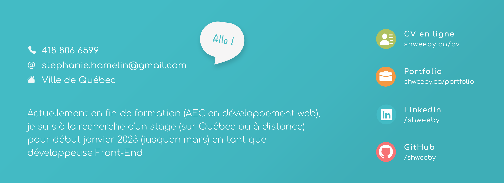

# À propos de moi 

Actuellement en fin de formation (AEC en développement web), je suis à la recherche d'un stage (sur Québec ou à distance) pour début janvier 2023 (jusqu'en mars) en tant que développeuse Front-End

Vous trouverez ici quelques projets que j'ai réalisés dans le cadre de mon AEC, que ce soit en graphisme, en intégration, programmation ou autre :

### Graphisme 

- [Projet 1 : Interface de type Netflix](https://github.com/Shweeby/aec-sess1-graph-projet1)
- [Projet 2 : Graphisme simple pour un salon de coiffure](https://github.com/Shweeby/aec-sess1-graph-projet2)
- [Projet 3 : Site web transactionnel fictif pour la location de chats](https://github.com/Shweeby/aec-sess1-graph-projet3)

### Animation 

- [Projet 3 : Animation d'un logo](https://github.com/Shweeby/aec-sess2-anim-projet3)

### Intégration 

- [Projet 1 : Petit quiz en JQuery et Bootstrap 4](https://github.com/Shweeby/aec-sess2-integ-projet1)
- [Projet 2 : Site web Dragon Ball en Bootstrap](https://github.com/Shweeby/aec-sess2-integ-projet2)

### Programmation 

- [Projet 1 : Formulaire très simple en JavaScript](https://github.com/Shweeby/aec-sess2-prog-projet1)
- [Projet 2 : Sapin en JavaScript](https://github.com/Shweeby/aec-sess2-prog-projet2)
- [Projet 3 : Formulaire de commande de pizza en JavaScript](https://github.com/Shweeby/aec-sess2-prog-projet3)
- [Projet 4 : Jeu avec des dés en Javascript](https://github.com/Shweeby/aec-sess2-prog-projet4)
- [Projet 5 : Formulaire de commande et Quiz diaporama](https://github.com/Shweeby/aec-sess2-prog-projet5)

### Projet de production

- [Plateforme web développée à plusieurs](https://github.com/Shweeby/aec-sess2-projet-prod)

# Je suis aussi là !  

- [Mon site web personnel](http://www.shweeby.ca)
- [Mon curriculum vitae](http://shweeby.ca/CV-Stephanie-Hamelin-2022.pdf)
- [Mon compte LinkedIn](https://www.linkedin.com/in/shweeby/)

